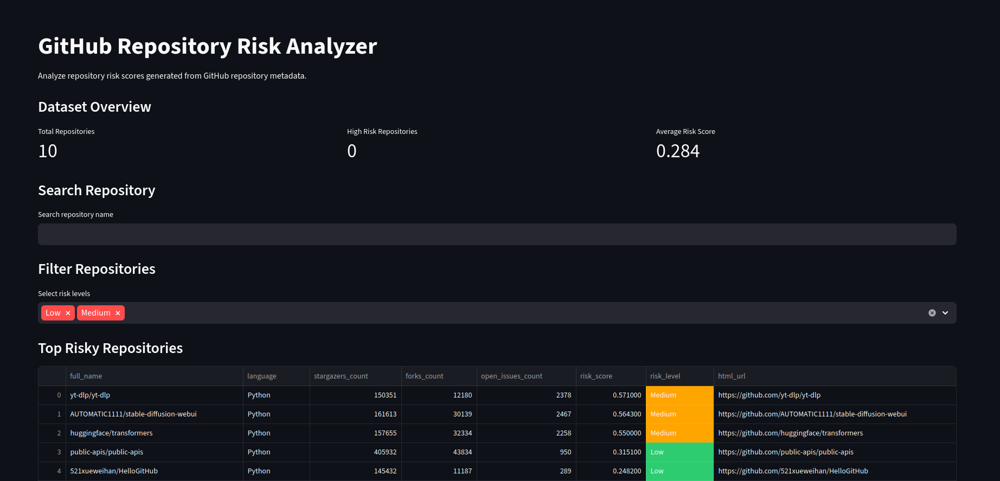
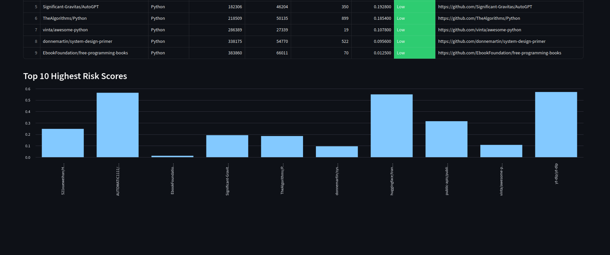

# 🚧 Project Status: In Development
# GitHub Repo Risk Analyzer

## Repository Description
A machine learning-based platform that analyzes public GitHub repositories to identify risky code areas and predict bug-prone files using repository mining and development activity data.

## GitHub Topics
### - machine-learning

### - data-science

### - github-api

### - repository-mining

### - software-analytics

### - bug-prediction

### - python

### - streamlit

### - scikit-learn

## Project Overview

GitHub Repo Risk Analyzer is a machine learning-driven repository analytics platform designed to analyze public GitHub repositories and identify potential software risk patterns.

The system collects repository activity data, processes development history, extracts meaningful features, and applies machine learning models to estimate which files or modules are more likely to produce bugs in the future.

The project transforms raw repository development activity into meaningful insights that help developers understand repository health, detect unstable modules, and identify potential software risks.

The system combines several domains:

### - Software Engineering Analytics

### - Machine Learning

### - Repository Mining

### - Data Science

### - Development Activity Analysis

The goal is to create a system that evaluates repository stability and predicts risky code areas based on historical development patterns.

## 📊 Dashboard Preview
The project includes an interactive Streamlit dashboard used to explore repository risk score.

## Dashboard Overview



## Risk Analysis Table 



## Background

Modern software projects generate a large amount of historical development data through version control systems like Git.

Each repository contains valuable information about how software evolves over time, including:

### - commit history

### - file modifications

### - pull requests

### - issues

### - contributor activity

### - development patterns

Despite this valuable data, many development teams rarely use repository history for predictive insights.

Repository mining allows us to extract meaningful patterns from development activity.

By analyzing repository history, it becomes possible to identify:

### - unstable code modules

### - bug-prone files

### - risky development patterns

### - collaboration behavior between developers

This project explores how machine learning can be applied to repository history to detect risk patterns in software systems.

## Project Objectives

The main objective of this project is to design a machine learning system capable of analyzing public GitHub repositories and predicting potential software risks.

The project aims to:

### - collect data from public GitHub repositories

### - analyze commit history and development behavior

### - extract repository activity features

### - generate labels related to bug-fix activity

### - train machine learning models for risk prediction

### - visualize repository analytics through an interactive dashboard

### - evaluate repository health and code stability

## System Architecture

The project follows a modular architecture where each component is responsible for a specific task in the analysis pipeline.

### Architecture Diagram

            +----------------------+
            |     GitHub API       |
            | (Public Repositories)|
            +----------+-----------+
                       |
                       v
            +----------------------+
            |   Data Collection    |
            | (Commits, Issues,   |
            | Pull Requests, Files)|
            +----------+-----------+
                       |
                       v
            +----------------------+
            |    Raw Data Storage  |
            |      (JSON / CSV)    |
            +----------+-----------+
                       |
                       v
            +----------------------+
            |   Data Processing    |
            |   Cleaning & Merge   |
            +----------+-----------+
                       |
                       v
            +----------------------+
            |  Feature Engineering |
            | Repository Metrics   |
            +----------+-----------+
                       |
                       v
            +----------------------+
            | Machine Learning     |
            | Bug Risk Prediction  |
            +----------+-----------+
                       |
                       v
            +----------------------+
            |   Visualization      |
            | Streamlit Dashboard  |
            +----------------------+

This architecture ensures that the system can scale and remain modular as the project grows.

## Machine Learning Pipeline

The machine learning component follows a structured pipeline to transform repository data into predictive insights.

### ML Pipeline Diagram
```
Raw GitHub Repository Data
            |
            v
Data Preprocessing
(Cleaning & Normalization)
            |
            v
Feature Engineering
(Commit Frequency, Contributors,
Code Churn, Change History)
            |
            v
Label Generation
(Bug Fix Commit Detection)
            |
            v
Train / Test Split
            |
            v
Model Training
(Random Forest / Logistic Regression)
            |
            v
Model Evaluation
(Accuracy, Precision, Recall)
            |
            v
Risk Prediction
(File-Level Bug Probability)
```

This pipeline ensures that repository data is properly prepared before training machine learning models.

## Feature Engineering

Repository activity is transformed into structured features used by machine learning models.

Examples of extracted features:

### - number of commits affecting a file

### - number of developers modifying a file

### - lines of code added or deleted

### - pull request activity

### - frequency of recent changes

### - historical modification intensity

### - bug-related commit frequency

Example dataset structure:

| file_name | commit_count | developers | lines_changed | bug_related |
|----------|--------------|-----------|--------------|------------|
| auth.py  | 42           | 5         | 310          | 1          |
| cart.py  | 12           | 2         | 95           | 0          |

## Machine Learning Models

The project uses supervised machine learning models to estimate bug risk.

Possible models include:

### - Logistic Regression

### - Random Forest

### - Gradient Boosting

### - XGBoost

These models analyze development patterns to predict which files are likely to become problematic.

Prediction outputs may include:

### - binary classification (risky vs non-risky files)

### - probability-based risk score

### - ranking of files based on bug likelihood

## Example Output

```
Repository Health Score: 81/100

High Risk Files
---------------

auth.py             72%
payment_service.py  64%
checkout.py         59%

Moderate Risk
-------------

cart_manager.py     34%

Low Risk
--------

README.md           3%
```
This helps developers identify unstable modules and prioritize code reviews.

## Technology Stack

The project uses the Python data science ecosystem.

Main technologies include:

### - Python

### - GitHub REST API

### - Pandas

### - NumPy

### - Scikit-learn

### - XGBoost (optional)

### - Requests / HTTPX

### - Streamlit

### - Matplotlib / Plotly

### - Python-dotenv


## Project Structure
```
github-repo-risk-analyzer/
│
├── data/
│   ├── raw/                 # Raw data collected from GitHub API
│   └── processed/           # Cleaned datasets
│
├── src/
│   ├── api/                 # GitHub API data collection
│   ├── processing/          # Data cleaning and preprocessing
│   ├── features/            # Feature engineering
│   ├── models/              # Machine learning training
│   ├── evaluation/          # Model evaluation
│   └── dashboard/           # Streamlit dashboard
│
├── notebooks/               # Exploratory analysis
├── tests/                   # Unit tests
│
├── .env                     # GitHub API token
├── requirements.txt         # Dependencies
├── README.md
└── main.py
```

## Limitations

This project has several limitations:

### - only public repositories are analyzed

### - bug labels are generated heuristically

### - repository quality varies across GitHub

### - commit messages may not always reflect real bug fixes

### - some repositories do not consistently use issues or pull requests

These limitations are expected in early-stage repository mining systems.

## Future Improvements

Possible improvements include:

### - static code analysis integration

### - improved bug labeling techniques

### - pull request risk prediction

### - repository comparison tools

### - developer collaboration network analysis

### - graph-based machine learning models

### - large-scale repository mining

### - GitHub App integration

## Conclusion

GitHub Repo Risk Analyzer demonstrates how machine learning can be applied to software engineering data.

By analyzing repository history, development activity, and file change patterns, the system predicts risky code areas and helps developers understand project stability.

The project serves both as a research exploration and as a practical machine learning application in software engineering analytics.


